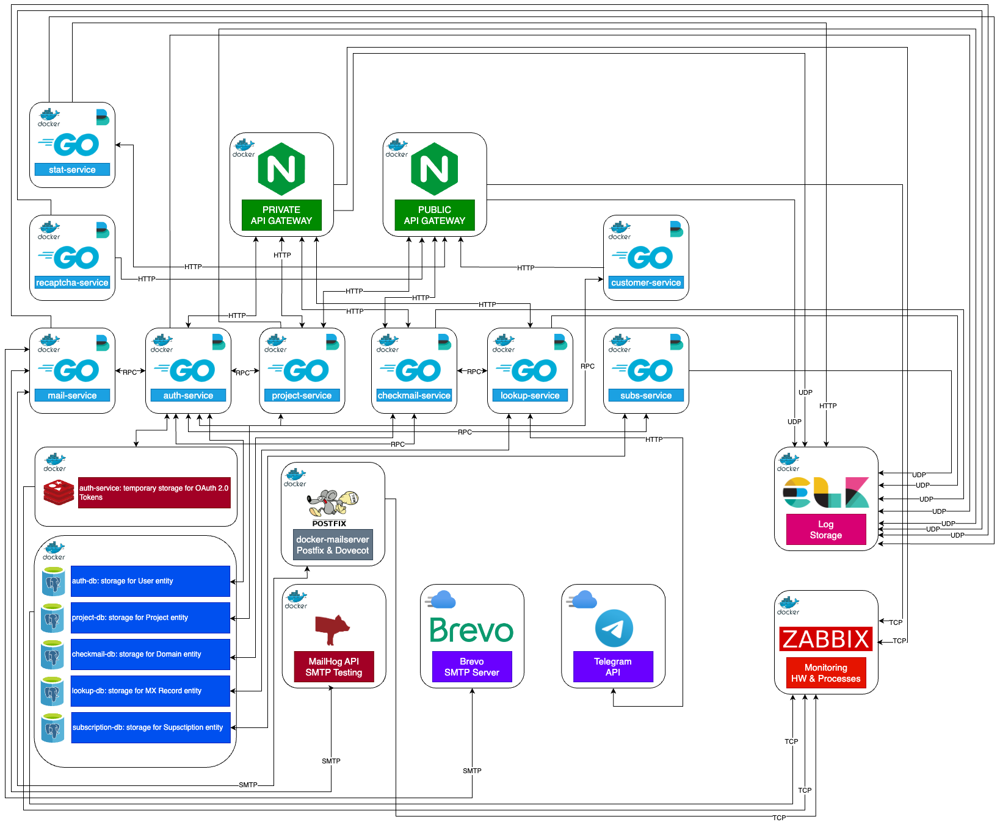

# verifire-gateway

### 💎 Pretty simple Nginx Gateway configuration for microservices.

___
### ⚙️ Public API methods as service. With Auth: X-AUTH-TOKEN

| METHOD | ENDPOINT                  |
|--------|---------------------------|
| POST   | {API_URL}/v1/data/inspect |

___
### ⚙️ [DEPRECATED] Public API methods as service. Proxy Adapter that uses the checkmail-service. With Auth: Bearer Token

| METHOD | ENDPOINT                  |
|--------|---------------------------|
| GET    | {API_URL}/domain/check    |

___
### 📱 Public REST API methods as backend Billing APP. Without Auth, but with reCAPTCHA

| METHOD | ENDPOINT                                        |
|--------|-------------------------------------------------|
| POST   | {GATEWAY_URL}/auth/v1/user/register             |
| POST   | {GATEWAY_URL}/auth/v1/user/confirm-registration |
| POST   | {GATEWAY_URL}/auth/v1/user/login                |
| POST   | {GATEWAY_URL}/auth/v1/user/reset-password       |
| POST   | {GATEWAY_URL}/checkmail/v1/domains/count        |
| POST   | {GATEWAY_URL}/checkmail/v1/data/inspect         |
| POST   | {GATEWAY_URL}/checkmail/v1/filters              |
| POST   | {GATEWAY_URL}/mail/v1/feedback                  |

___
### 📲 Public REST API methods as backend Billing APP. With Auth: Bearer Token - [Startup, Business Roles]

| METHOD | ENDPOINT                                      |
|--------|-----------------------------------------------|
| POST   | {GATEWAY_URL}/auth/v1/user/logout             |
| POST   | {GATEWAY_URL}/auth/v1/token/refresh           |
| GET    | {GATEWAY_URL}/auth/v1/user                    |
| GET    | {GATEWAY_URL}/project/v1/projects             |
| GET    | {GATEWAY_URL}/project/v1/projects/{projectId} |
| POST   | {GATEWAY_URL}/project/v1/projects             |
| PATCH  | {GATEWAY_URL}/project/v1/projects/{projectId} |
| DEL    | {GATEWAY_URL}/project/v1/projects/{projectId} |

___
### 🛠 Public REST API methods as backend Support Panel APP : Bearer Token - [Admin, Support Roles]

| METHOD | ENDPOINT                                        |
|--------|-------------------------------------------------|
| POST   | {GATEWAY_URL}/auth/v1/user/logout               |
| POST   | {GATEWAY_URL}/auth/v1/token/refresh             |
| GET    | {GATEWAY_URL}/checkmail/v1/domains/{domainName} |
| POST   | {GATEWAY_URL}/checkmail/v1/domains              |
| PATCH  | {GATEWAY_URL}/checkmail/v1/domains/{domainName} |
| DEL    | {GATEWAY_URL}/checkmail/v1/domains/{domainName} |
| GET    | {GATEWAY_URL}/lookup/v1/mxrecords               |
| GET    | {GATEWAY_URL}/lookup/v1/mxrecords/{data}        |
| POST	  | {GATEWAY_URL}/lookup/v1/mxrecords               |
| PATCH  | {GATEWAY_URL}/lookup/v1/mxrecords/{data}        |
| DEL    | {GATEWAY_URL}/lookup/v1/mxrecords/{data}        |
| GET    | {GATEWAY_URL}/project/v1/projects               |
| GET    | {GATEWAY_URL}/project/v1/projects/{projectId}   |
| POST	  | {GATEWAY_URL}/project/v1/projects               |
| PATCH  | {GATEWAY_URL}/project/v1/projects/{projectId}   |
| DEL    | {GATEWAY_URL}/project/v1/projects/{projectId}   |